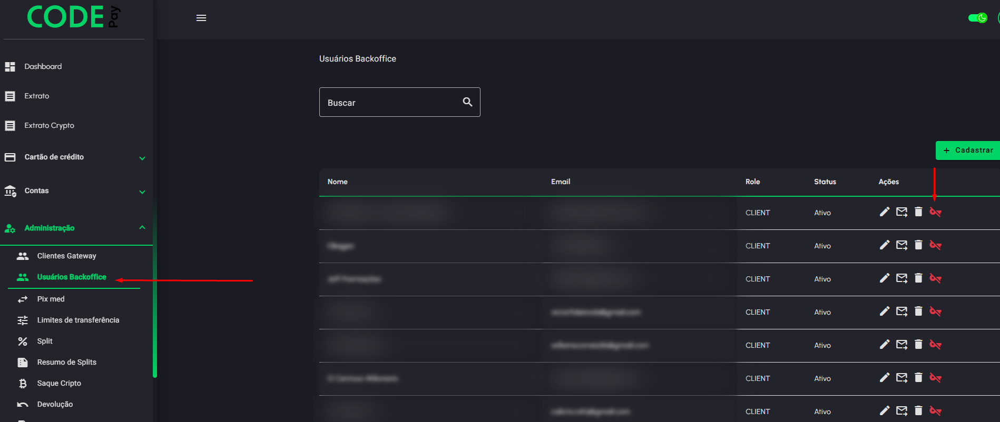

# Gestão de usuários Codepay

### Excluir a senha de transação

<figure><figcaption></figcaption></figure>

No painel admin, acesse o item <mark style="color:green;">**Administração**</mark> e clique em <mark style="color:green;">**Usuários Backoffice**</mark>. Busque o usuário que deseja excluir a senha de transação e clique no ícone de **delete** conforme na imagem.

Leia o alerta com atenção e informe o seu segundo fator de segurança, clique em confirmar exclusão.

<figure><figcaption></figcaption></figure>

### Excluir segundo fator de segurança (2fa)

<figure><figcaption></figcaption></figure>

No painel admin, acesse o item <mark style="color:green;">**Administração**</mark> e clique em <mark style="color:green;">**Usuários Backoffice**</mark>. Busque o usuário que deseja excluir o segundo fator de segurança (2fa) e clique no ícone de **chave** conforme na imagem.

Leia o alerta com atenção e informe sua senha de acesso e o seu segundo fator de segurança, clique em confirmar exclusão.

<figure><figcaption></figcaption></figure>
