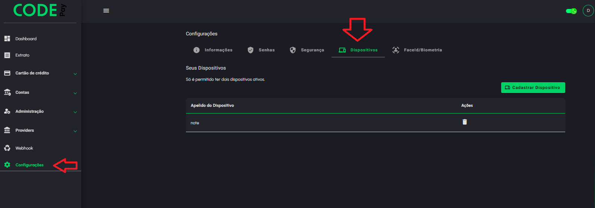

# Dispositivos

Para realizar as operações no painel administrativo do Code Pay é necessário cadastrar o dispositivo e ter permissão de acesso ao painel.

Para cadastrar o dispositivo no menu configurações selecione o ítem dispositivos.

<figure><figcaption></figcaption></figure>

Clique no botão Cadastrar Dispositivo e preencha os campos com um apelido para o dispositivo a ser cadastrado, informe sua senha de acesso e o código 2fa da sua conta. Clique em confirmar


Só pode ser cadastrado 2 dispositivos. Se você já tiver 2 cadastrados, exclua um e cadastre o que precisa.


<figure><figcaption></figcaption></figure>
